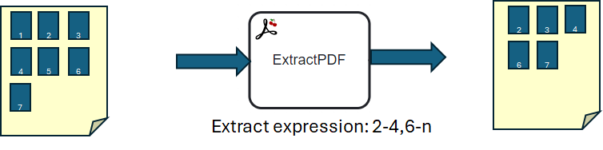
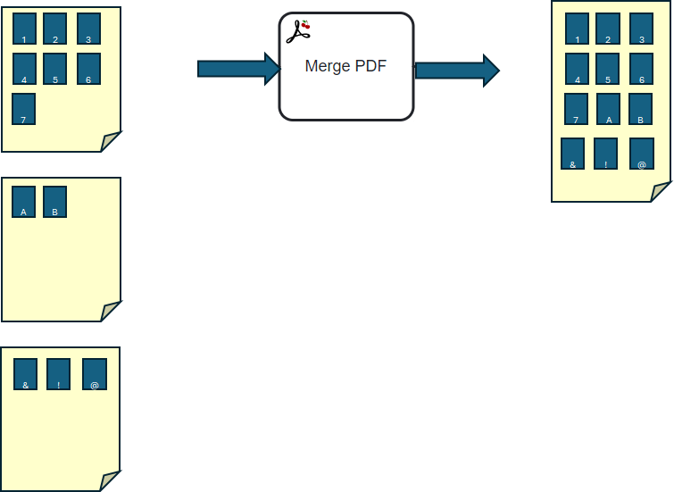
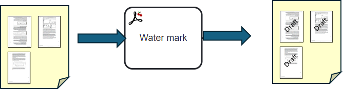
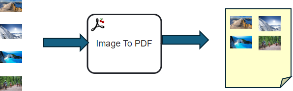

[](https://github.com/Camunda-Community-Hub/community/blob/main/extension-lifecycle.md#incubating-)
[](https://github.com/camunda-community-hub/community)


# camunda-8-connector-pdf
The connector offers multiple functions on PDF documents.

These connectors used the File Storage library to access and save documents. See below.
Use the load connector to upload the document during the process. See Cherry FileStorage connector (https://github.com/camunda-community-hub/zeebe-cherry-framework or https://github.com/camunda-community-hub/camunda-8-connector-filestorage)

The first parameter is the PDF function. According to the function you chose, different parameters show up.


# Extract pages



## Principle
From a PDF document to an extract expression, a new PDF is built.

## Inputs
| Name                          | Description                   | Class            | Default | Level     |
|-------------------------------|-------------------------------|------------------|---------|-----------|
| sourceFile                    | File reference                | java.lang.Object |         | REQUIRED  |
| extractExpression             | Expression (1)                | java.lang.String |         | REQUIRED  | 
| destinationFileName           | Name of the destination file  | Java.lang.String |         | REQUIRED  |
| destinationStorageDefinition  | Storage definition (2)        | Java.lang.String |         | REQUIRED  |

(1) the expression is a sequence of intervals. An interval is a page number or two pages separated by a -.
The unique character "n" indicates the last page of the document.
The first page is named 1

For example:
* "5" extract page number 5
* "5,8" extract pages 5 and 8. The result will have two pages
* "3-4, 8-12, 15" extract pages 3,4,8,9,10,11,12,15
* "6-8, 11-n" extract pages 6,7,8, then page 11 and pages after 11 until the end of the document.

(2) the storage definition indicates where the document must be saved. It is different
storage definition usable (TEMPFOLDER, FOLDER, CMIS).
If no value is given, then the storage definition of the source file is used.

## Output
| Name             | Description                     | Class            | Level    |
|------------------|---------------------------------|------------------|----------|
| destinationFile  | Reference to the file produced  | java.lang.String | REQUIRED |

## BPMN Errors

| Name                                     | Explanation                                                                                                                                      |
|------------------------------------------|--------------------------------------------------------------------------------------------------------------------------------------------------|
| LOAD_ERROR                               | An error occurs during the load                                                                                                                   |
| LOAD_DOCSOURCE                           | The reference can't be decoded                                                                                                                   |
| BAD_STORAGE_DEFINITION                   | The storage definition does not correctly describe |
| NO_DESTINATION_STORAGE_DEFINITION_DEFINE | A storage definition must be set to store the result document                                                                                    |
| LOAD_PDF_ERROR                           | Error reading the document - is that a PDF?                                                                                                      |
| ENCRYPTED_PDF_NOT_SUPPORTED              | Encrypted PDF is not supported                                                                                                                   |
| ERROR_CREATE_FILEVARIABLE                | Error when reading the PDF to create a fileVariable to save                                                                                      |
| SAVE_ERROR                               | An error occurs during the save                                                                                                                  |
| INVALID_EXPRESSION                       | Invalid expression to pilot the extraction. Format must be <number1>-<number2> where number1<=number2. n means 'end of document' : example, 10-n |
| EXTRACTION_ERROR                         | Extraction error                                                                                                                                 |


# Merge PDF




## Principle

A list of PDF documents is in input, and one document is produced.
The resulting document contains all pages from the first document, the second document, and so on.
The order from the input list is used to produce the result.

## Inputs
| Name                           | Description                  | Class            | Default | Level    |
|--------------------------------|------------------------------|------------------|---------|----------|
| listSourceFile                 | Files to add                 | java.lang.Object |         | REQUIRED |
| destinationFileName            | Name of the destination file | Java.lang.String |         | REQUIRED  |
| destinationStorageDefinition   | Storage definition (2)       | Java.lang.String |         | REQUIRED  |

(2) the storage definition indicates where the document must be saved. It is different
storage definition usable (TEMPFOLDER, FOLDER, CMIS).
If no value is given, then the storage definition of the source file is used.

## Output
| Name             | Description                                         | Class             | Level    |
|------------------|-----------------------------------------------------|-------------------|----------|
| destinationFile  | FileVariable converted (a File Variable Reference)  | java.lang.Object  | REQUIRED |


## BPMN Errors

| Name                                     | Explanation                                                    |
|------------------------------------------|----------------------------------------------------------------|
| LOAD_ERROR                               | An error occurs during the load                                 |
| LOAD_DOCSOURCE                           | The reference can't be decoded                                 |
| BAD_STORAGE_DEFINITION                   | The storage definition does not correctly describe |
| NO_DESTINATION_STORAGE_DEFINITION_DEFINE | A storage definition must be set to store the result document  |
| LOAD_PDF_ERROR                           | Error reading the document - is that a PDF?                    |
| ENCRYPTED_PDF_NOT_SUPPORTED              | Encrypted PDF is not supported                                 |
| ERROR_CREATE_FILEVARIABLE                | Error when reading the PDF to create a fileVariable to save    |
| SAVE_ERROR                               | An error occurs during the save                                |
| OPERATION_FAILED                         | An error occurred during the operation                            |
| NO_DESTINATION_STORAGE_DEFINITION        | A storage definition must be set to store the result document  |


# Watermark



## Principle

A watermark is added to each page. The watermark can be placed at the bottom, center, or lower, rotated, and set in size and color.

## Inputs
| Name                         | Description                                                                               | Class            | Default | Level    |
|------------------------------|-------------------------------------------------------------------------------------------|------------------|---------|----------|
| sourceFile                   | For the file to convert                                                                   | java.lang.Object |         | REQUIRED |
| waterMark                    | Text to add                                                                               | java.lang.String |         | REQUIRED |
| watermarkPosition            | Position (TOP, CENTER, BOTTOM)                                                             | java.lang.String |         | REQUIRED |
| watermarkColor               | Color (red, green, black, blue, cyan, gray,darkGray,lightGray, magenta, orange, pink, white, yellow | java. lang.String |         | OPTIONAL |
| watermarkRotation            | Rotation, 0 to 360, clockwise                                                             | java.lang.Long   | 0       | OPTIONAL |
| destinationFileName          | Name of the destination file                                                              | Java.lang.String |         | REQUIRED  |
| destinationStorageDefinition | Storage definition (2)                                                                    | Java.lang.String |         | REQUIRED  |

(2) the storage definition indicates where the document must be saved. It is different
storage definition usable (TEMPFOLDER, FOLDER, CMIS).
If no value is given, then the storage definition of the source file is used.


## Output
| Name             | Description                                         | Class             | Level    |
|------------------|-----------------------------------------------------|-------------------|----------|
| destinationFile  | FileVariable converted (a File Variable Reference)  | java.lang.Object  | REQUIRED |

## BPMN Errors

| Name                                     | Explanation                                                    |
|------------------------------------------|----------------------------------------------------------------|
| LOAD_ERROR                               | An error occurs during the load                                 |
| LOAD_DOCSOURCE                           | The reference can't be decoded                                 |
| BAD_STORAGE_DEFINITION                   | The storage definition does not correctly describe |
| NO_DESTINATION_STORAGE_DEFINITION_DEFINE | A storage definition must be set to store the result document  |
| LOAD_PDF_ERROR                           | Error reading the document - is that a PDF?                    |
| ENCRYPTED_PDF_NOT_SUPPORTED              | Encrypted PDF is not supported                                 |
| ERROR_CREATE_FILEVARIABLE                | Error when reading the PDF to create a fileVariable to save    |
| SAVE_ERROR                               | An error occurs during the save                                |
| INVALID_COLOR                            | Invalid color                                                  |
| OPERATION_FAILED                         | An error occurred during the operation                            |


# image(s) to PDF



## Principle

Get a list of images and create a PDF from it.

## Inputs
| Name                         | Description                  | Class             | Default | Level    |
|------------------------------|------------------------------|-------------------|---------|----------|
| listSourceFile               | List of files to merge       | java.lang.List    |         | REQUIRED |
| destinationFileName          | Name of the destination file | Java.lang.String  |         | REQUIRED  |
| destinationStorageDefinition | Storage definition (2)       | Java.lang.String  |         | REQUIRED  |


## Output
| Name             | Description                                         | Class             | Level    |
|------------------|-----------------------------------------------------|-------------------|----------|
| destinationFile  | FileVariable converted (a File Variable Reference)  | java.lang.Object  | REQUIRED |

## BPMN Errors

| Name                               | Explanation                                                   |
|------------------------------------|---------------------------------------------------------------|
| LOAD_ERROR                         | An error occurs during the load                                |
| LOAD_DOCSOURCE                     | The reference can't be decoded                                |
| ACCESS_SOURCE_IMAGE                | Can't access the source image                                 |
| DRAW_IMAGE                         | Error during the import of the image in the PDF               |
| NO_DESTINATION_STORAGE_DEFINITION  | A storage definition must be set to store the result document |
| DEFINITION_ERROR                   | Error during the definition                                   |
| OPERATION_FAILED                   | An error occurred during the operation                           |

# PDF to Image(s)


## Principle

Take a PDF, and create one image per page.

## Inputs

| Name                         | Description                  | Class             | Default | Level    |
|------------------------------|------------------------------|-------------------|---------|----------|
| sourceFile                   | List of files to merge       | java.lang.List    |         | REQUIRED |
| destinationFileName          | Name of the destination file | Java.lang.String  |         | REQUIRED |
| destinationStorageDefinition | Storage definition (2)       | Java.lang.String  |         | REQUIRED |


## Output
| Name                | Description    | Class           | Level    |
|---------------------|----------------|-----------------|----------|
| listDestinationFile | List of files  | java.lang.List  | REQUIRED |

## BPMN Errors

| Name                                     | Explanation                                                                                                                                      |
|------------------------------------------|--------------------------------------------------------------------------------------------------------------------------------------------------|
| LOAD_ERROR                               | An error occurs during the load                                                                                                                   |
| LOAD_DOCSOURCE                           | The reference can't be decoded                                                                                                                   |   
| BAD_STORAGE_DEFINITION                   | The storage definition does not correctly describe |
| NO_DESTINATION_STORAGE_DEFINITION_DEFINE | A storage definition must be set to store the result document                                                                                    |
| ERROR_CREATE_FILEVARIABLE                | Error when reading the PDF to create a fileVariable to save                                                                                      |
| SAVE_ERROR                               | An error occurs during the save                                                                                                                  |
| INVALID_EXPRESSION                       | Invalid expression to pilot the extraction. Format must be <number1>-<number2> where number1<=number2. n means 'end of document' : example, 10-n |
| OPERATION_FAILED                         | An error occurred during the operation                                                                                                              |


## Manipulating file

Via the **File Storage** library, The process variable contains the only reference.
The core document may be saved in a Folder, Temporary Folder, CMIS, or any repository available via the library.

The result is saved in the File Storage: this is why the connector asks for a StorageDefinition.
The result process variable will contain only the reference to the file. If no "destinationStorageDefinition"
is provided, the PDF is saved in the same storage as the source document.

To get the file's result on a file system, use any connector or application that uses the File Storage API.

Find the user documentation in our [Camunda Platform 8 Docs](https://docs.camunda.io/docs/components/integration-framework/connectors/out-of-the-box-connectors/slack/).

# Build

```bash
mvn clean package
```

Two jars are produced. The jar with all dependencies can be upload in the [Cherry Framework](https://github.com/camunda-community-hub/zeebe-cherry-framework)

## Element Template

The element template can be found in the [element-templates](element-template) directory.
