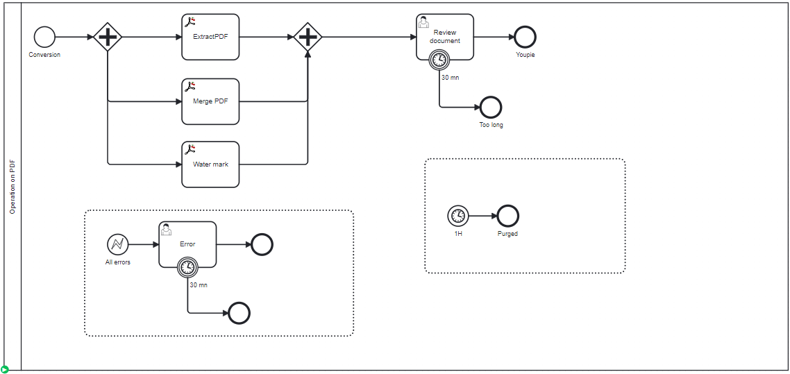

# Run the test

## Test it

To test it:

### Specify a Zeebe server
Check the file src/test/resources/application.yaml and set up the configuration to connect a Zeebe server

## Deploy the process
Deploy the PdfOperation.bpmn process




## Start the LocalConnectorRuntime
Source is located io.camunda.pdf.LocalConnectorRuntime. Start it.


## Create a process instance
Two tasks will be executed, and the process instance will show up in the Review Document. 
PDF are saved in the temporary folder of the machine.


## Information
The connector load different PDF file from Internet

The Source File is :
`````json
{
  "storageDefinition": "URL", 
  "content": "https://github.com/camunda-community-hub/camunda-8-connector-pdf/raw/main/src/test/resources/BPMN%202.0%20Symbols.pdf"
}
`````

Differnt PDF are created and saved in the TEMP Folder on the runtime (so not very easy to access). 
Check if you see any errors.
